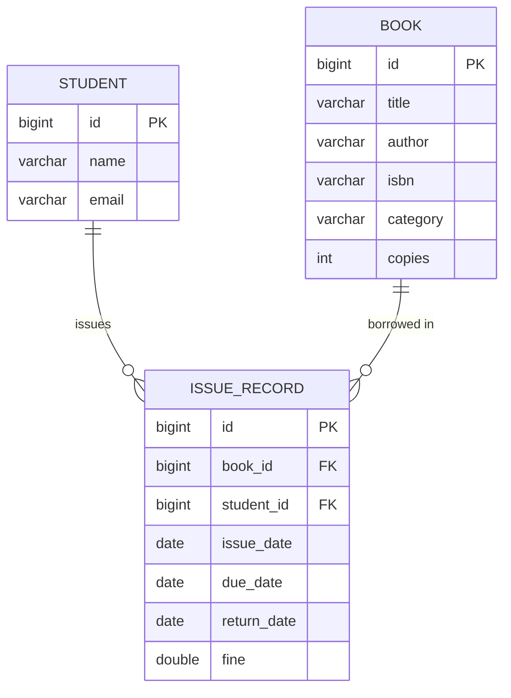

# LibroTrack — Library Book Issue and Return Manager

A clean, beginner-friendly Spring Boot backend application built for managing library books, student borrowings, and returns with automated fine calculation.

---

## Table of Contents
1. [Project Overview](#project-overview)
2. [Tech Stack](#tech-stack)
3. [Project Structure](#project-structure)
4. [Prerequisites](#prerequisites)
5. [Step-by-Step Setup Guide with XAMPP](#step-by-step-setup-guide-with-xampp)
6. [Configuring application.properties](#configuring-applicationproperties)
7. [How to Build and Run End-to-End](#how-to-build-and-run-end-to-end)
8. [Database Schema & Relationships](#database-schema--relationships)
9. [Complete Postman API Guide (Step-by-Step Test Sequence)](#complete-postman-api-guide)
10. [Business Rules Enforced](#business-rules-enforced)
11. [Viva & Interview Questions (Student Guide)](#viva--interview-questions)

---

## 1. Project Overview

**LibroTrack** solves the real-world problem of manually managing library registers. It provides REST APIs to:
- Catalog and update books (title, author, ISBN, category, available copies).
- Issue books to students with an automatic 14-day loan period.
- Automatically decrement available book inventory upon issue.
- Prevent issuing books when all copies are checked out.
- Return books, automatically restore available inventory, and calculate overdue fines at a rate of ₹5 per day past the due date.
- Search books by title, author, or category.
- List all currently issued books for a particular student.

---

## 2. Tech Stack

- **Language:** Java 21
- **Framework:** Spring Boot 3.4.3
- **Data Access:** Spring Data JPA / Hibernate
- **Database:** MySQL (via XAMPP or Standalone MySQL Server)
- **Validation:** Jakarta Bean Validation (`@NotBlank`, `@NotNull`, `@Min`, `@Email`)
- **Build Tool:** Maven (Wrapper included: `mvnw`)
- **Testing Tool:** Postman / cURL

> **Student Note:** This project intentionally uses standard Java getters, setters, and constructors without Lombok, external DTOs, or complex abstractions. Every class is transparent, readable, and easy to explain during a viva or practical exam.

---

## 3. Project Structure

```
com.example.librotrack
│
├── LibrotrackApplication.java          # Spring Boot main entry point
│
├── entity
│   ├── Book.java                      # JPA Entity for books table
│   ├── Student.java                   # JPA Entity for students table
│   └── IssueRecord.java               # JPA Entity for issue_records table
│
├── repository
│   ├── BookRepository.java            # Spring Data JPA repository with search methods
│   ├── StudentRepository.java         # Spring Data JPA repository for students
│   └── IssueRecordRepository.java     # Spring Data JPA repository for issue records
│
├── service
│   └── LibraryService.java            # All business logic, validations & fine calculations
│
└── controller
    └── LibraryController.java         # REST endpoints and exception handlers
```

---

## 4. Prerequisites

Before running the project, ensure you have:
1. **Java Development Kit (JDK 21 or higher)**
   - Check via terminal:
     ```bash
     java -version
     ```
2. **XAMPP** (or MySQL Server 8.x)
   - Download from: [https://www.apachefriends.org/](https://www.apachefriends.org/)
3. **Postman**
   - Download from: [https://www.postman.com/downloads/](https://www.postman.com/downloads/)

---

## 5. Step-by-Step Setup Guide with XAMPP

### Step 5.1: Start MySQL in XAMPP
1. Open the **XAMPP Control Panel**.
2. Locate the **MySQL** module row.
3. Click the **Start** button next to **MySQL**.
   - The status will turn green and display port `3306`.
4. *(Optional)* Click **Start** next to **Apache** if you want to use the web-based phpMyAdmin UI.

### Step 5.2: Open phpMyAdmin
1. In your browser, navigate to:
   ```
   http://localhost/phpmyadmin
   ```
2. You will see the MySQL administration interface.

### Step 5.3: Create Database `librotrack`
1. Click on **New** in the left sidebar (or click the **Databases** tab at the top).
2. Under **Create database**, type:
   ```
   librotrack
   ```
3. Set the collation to `utf8mb4_general_ci` (or leave it as default).
4. Click **Create**.

> **Note:** You do NOT need to manually create tables or write `CREATE TABLE` scripts. Hibernate will automatically create all tables (`books`, `students`, `issue_records`) and foreign keys as soon as the Spring Boot app starts up!

---

## 6. Configuring `application.properties`

The configuration file is located at:
`src/main/resources/application.properties`

### Default Template:
```properties
spring.datasource.url=jdbc:mysql://localhost:3306/librotrack
spring.datasource.username=YOUR_USERNAME
spring.datasource.password=YOUR_PASSWORD

spring.jpa.hibernate.ddl-auto=update
spring.jpa.show-sql=true
```

### For Default XAMPP MySQL:
In standard XAMPP installations, the default MySQL user is `root` with **no password** (empty). Update the file to:
```properties
spring.datasource.url=jdbc:mysql://localhost:3306/librotrack?createDatabaseIfNotExist=true&useSSL=false&serverTimezone=UTC
spring.datasource.username=root
spring.datasource.password=

spring.jpa.hibernate.ddl-auto=update
spring.jpa.show-sql=true
```

---

## 7. How to Build and Run End-to-End

### Option A: Using Maven Wrapper (Command Prompt / PowerShell)
Open your terminal in the project directory (`e:\Project 2`):

1. **Verify or set JAVA_HOME (if required):**
   ```powershell
   $env:JAVA_HOME = "C:\Program Files\Java\jdk-21"
   ```

2. **Compile the project:**
   ```powershell
   .\mvnw.cmd clean compile
   ```
   You should see: `BUILD SUCCESS`.

3. **Run the Spring Boot application:**
   ```powershell
   .\mvnw.cmd spring-boot:run
   ```

### Option B: Package as JAR and Run
1. **Package the executable JAR:**
   ```powershell
   .\mvnw.cmd clean package -DskipTests
   ```
2. **Run the JAR:**
   ```powershell
   java -jar target/librotrack-0.0.1-SNAPSHOT.jar
   ```

### How to Confirm It is Running:
In your terminal, look for the following log output:
```text
Tomcat started on port 8080 (http) with context path '/'
Started LibrotrackApplication in X.XXX seconds
```
The server is now live at: `http://localhost:8080`

---

## 8. Database Schema & Relationships



- **`students`**: Stores student registration details.
- **`books`**: Stores cataloged books and current stock of copies.
- **`issue_records`**: Maps which student borrowed which book, tracks dates, and records fine calculation upon return.

---

## 9. Complete Postman API Guide

Open Postman and create a collection named **LibroTrack**. Test the endpoints in the sequence described below.

---

### Step 0: Insert a Student into Database
Because student records originate from the college database, insert at least one student before issuing books.

You can execute this query directly in **phpMyAdmin** (`http://localhost/phpmyadmin` -> select `librotrack` database -> click **SQL** tab):
```sql
INSERT INTO students (id, name, email) VALUES (1, 'Alice Smith', 'alice.smith@example.com');
```

---

### Step 1: Add a Book
- **Method:** `POST`
- **URL:** `http://localhost:8080/api/books`
- **Headers:** `Content-Type: application/json`
- **Request Body (raw JSON):**
```json
{
  "title": "Clean Code",
  "author": "Robert C. Martin",
  "isbn": "978-0132350884",
  "category": "Software Engineering",
  "copies": 3
}
```
- **Expected Status:** `201 Created`
- **Response Body:**
```json
{
  "id": 1,
  "title": "Clean Code",
  "author": "Robert C. Martin",
  "isbn": "978-0132350884",
  "category": "Software Engineering",
  "copies": 3
}
```

*Add another book for search testing:*
```json
{
  "title": "Effective Java",
  "author": "Joshua Bloch",
  "isbn": "978-0134685991",
  "category": "Programming",
  "copies": 1
}
```

---

### Step 2: Update a Book
- **Method:** `PUT`
- **URL:** `http://localhost:8080/api/books/1`
- **Headers:** `Content-Type: application/json`
- **Request Body (raw JSON):**
```json
{
  "title": "Clean Code (2nd Edition)",
  "author": "Robert C. Martin",
  "isbn": "978-0132350884",
  "category": "Software Engineering",
  "copies": 5
}
```
- **Expected Status:** `200 OK`
- **Response Body:**
```json
{
  "id": 1,
  "title": "Clean Code (2nd Edition)",
  "author": "Robert C. Martin",
  "isbn": "978-0132350884",
  "category": "Software Engineering",
  "copies": 5
}
```

---

### Step 3: Search Books
The search API supports filtering by `title`, `author`, `category`, or general `query`.

#### Example 3A: Search by Title
- **Method:** `GET`
- **URL:** `http://localhost:8080/api/books/search?title=Effective`
- **Expected Status:** `200 OK`
- **Response Body:** Array containing "Effective Java".

#### Example 3B: Search by Author
- **Method:** `GET`
- **URL:** `http://localhost:8080/api/books/search?author=Martin`
- **Expected Status:** `200 OK`
- **Response Body:** Array containing "Clean Code".

#### Example 3C: Search by Category
- **Method:** `GET`
- **URL:** `http://localhost:8080/api/books/search?category=Programming`
- **Expected Status:** `200 OK`

#### Example 3D: View All Books (No parameters)
- **Method:** `GET`
- **URL:** `http://localhost:8080/api/books/search`
- **Expected Status:** `200 OK`
- **Response Body:** Array containing all books in catalog.

---

### Step 4: Issue a Book to a Student
- **Method:** `POST`
- **URL:** `http://localhost:8080/api/issues`
- **Headers:** `Content-Type: application/json`
- **Request Body (raw JSON):**
```json
{
  "bookId": 2,
  "studentId": 1
}
```
*(Alternatively supported via query parameters: `http://localhost:8080/api/issues?bookId=2&studentId=1`)*

- **Expected Status:** `201 Created`
- **Response Body:**
```json
{
  "id": 1,
  "book": {
    "id": 2,
    "title": "Effective Java",
    "author": "Joshua Bloch",
    "isbn": "978-0134685991",
    "category": "Programming",
    "copies": 0
  },
  "student": {
    "id": 1,
    "name": "Alice Smith",
    "email": "alice.smith@example.com"
  },
  "issueDate": "2026-09-28",
  "dueDate": "2026-10-12",
  "returnDate": null,
  "fine": 0.0
}
```
> **What happened automatically?**
> 1. Available copies of "Effective Java" decreased from 1 to 0.
> 2. `issueDate` was set to today's date.
> 3. `dueDate` was automatically calculated as `issueDate + 14 days`.
> 4. `returnDate` is initialized to `null`.
> 5. Initial `fine` is set to `0.0`.

---

### Step 5: Test Out-of-Stock Business Rule
Try issuing "Effective Java" (bookId = 2) again immediately:
- **Method:** `POST`
- **URL:** `http://localhost:8080/api/issues`
- **Headers:** `Content-Type: application/json`
- **Request Body:**
```json
{
  "bookId": 2,
  "studentId": 1
}
```
- **Expected Status:** `400 Bad Request`
- **Response Body:**
```json
{
  "error": "Book cannot be issued: all copies are already checked out."
}
```

---

### Step 6: List Currently Issued Books for a Student
- **Method:** `GET`
- **URL:** `http://localhost:8080/api/students/1/issues`
- **Expected Status:** `200 OK`
- **Response Body:**
```json
[
  {
    "id": 1,
    "book": {
      "id": 2,
      "title": "Effective Java",
      "author": "Joshua Bloch",
      "isbn": "978-0134685991",
      "category": "Programming",
      "copies": 0
    },
    "student": {
      "id": 1,
      "name": "Alice Smith",
      "email": "alice.smith@example.com"
    },
    "issueDate": "2026-09-28",
    "dueDate": "2026-10-12",
    "returnDate": null,
    "fine": 0.0
  }
]
```

---

### Step 7: Return a Book on Time (No Fine)
- **Method:** `PUT`
- **URL:** `http://localhost:8080/api/issues/1/return`
- **Expected Status:** `200 OK`
- **Response Body:**
```json
{
  "id": 1,
  "book": {
    "id": 2,
    "title": "Effective Java",
    "author": "Joshua Bloch",
    "isbn": "978-0134685991",
    "category": "Programming",
    "copies": 1
  },
  "student": {
    "id": 1,
    "name": "Alice Smith",
    "email": "alice.smith@example.com"
  },
  "issueDate": "2026-09-28",
  "dueDate": "2026-10-12",
  "returnDate": "2026-09-28",
  "fine": 0.0
}
```
> **What happened automatically?**
> 1. Available copies of "Effective Java" increased back to 1.
> 2. `returnDate` was recorded as today's date.
> 3. Returned on or before `dueDate`, so `fine` = 0.0.

---

### Step 8: Prevent Duplicate Returns
If you invoke `PUT http://localhost:8080/api/issues/1/return` again:
- **Expected Status:** `400 Bad Request`
- **Response Body:**
```json
{
  "error": "Book has already been returned on: 2026-09-28"
}
```

---

### Step 9: Overdue Return and Fine Calculation (₹5 / Day)
To simulate an overdue return in testing:
1. Issue a book to create issue record with `id = 2`.
2. In phpMyAdmin, change its `due_date` to 5 days ago:
   ```sql
   UPDATE issue_records SET due_date = DATE_SUB(CURDATE(), INTERVAL 5 DAY) WHERE id = 2;
   ```
3. Call `PUT http://localhost:8080/api/issues/2/return`:
- **Expected Status:** `200 OK`
- **Response Body:**
```json
{
  "id": 2,
  "returnDate": "2026-09-28",
  "dueDate": "2026-09-23",
  "fine": 25.0
}
```
*(5 overdue days × ₹5 = ₹25.0 fine automatically calculated and saved!)*

---

### Step 10: Input Validation Testing
Try adding a book with invalid/empty fields:
- **Method:** `POST`
- **URL:** `http://localhost:8080/api/books`
- **Request Body:**
```json
{
  "title": "",
  "author": "Unknown",
  "isbn": "12345",
  "copies": -2
}
```
- **Expected Status:** `400 Bad Request`
- **Response Body:**
```json
{
  "title": "Title is required",
  "copies": "Copies cannot be negative"
}
```

---

## 10. Business Rules Enforced

All business rules are implemented strictly in [`LibraryService.java`](file:///e:/Project%202/src/main/java/com/example/librotrack/service/LibraryService.java):

| Rule | Implementation Details |
|---|---|
| **Inventory Depletion** | When issuing a book, check `copies > 0`. If `copies <= 0`, throw an exception. Otherwise decrement `copies` by 1. |
| **Automatic Loan Period** | Issue date is set to `LocalDate.now()`. Due date is calculated automatically via `issueDate.plusDays(14)`. |
| **Inventory Restoration** | When returning, increment `copies` by 1 and save back to the database. |
| **Duplicate Return Check** | Checks `if (issueRecord.getReturnDate() != null)`. Prevents returning the same record multiple times. |
| **Overdue Fine Calculation** | If `returnDate.isAfter(dueDate)`, calculates `daysBetween * 5.0`. If returned on or before due date, fine is `0.0`. |
| **Active Issues Filter** | Currently issued books for a student are queried where `returnDate IS NULL`. |

---

## 11. Viva & Interview Questions

### Q1: Why use Spring Data JPA instead of plain JDBC?
> **Answer:** Spring Data JPA eliminates boilerplate SQL and connection management. By extending `JpaRepository`, we get CRUD methods (`save`, `findById`, `delete`) and query derivation (`findByTitleContainingIgnoreCase`) automatically without writing manual SQL queries.

### Q2: How does the fine calculation work in Java?
> **Answer:** We use Java 8+ `java.time.LocalDate` and `java.time.temporal.ChronoUnit.DAYS.between(dueDate, returnDate)`. If `returnDate.isAfter(dueDate)`, the difference in days is multiplied by 5.

### Q3: What is the purpose of `@ManyToOne` in `IssueRecord`?
> **Answer:** Multiple issue records can belong to the same book (at different times) and to the same student. `@ManyToOne` maps the foreign key columns `book_id` and `student_id` in the `issue_records` table.

### Q4: Why are business rules placed in the Service layer instead of the Controller?
> **Answer:** In standard layered architecture, Controllers only handle HTTP request parsing, routing, and HTTP response codes. All business logic, transaction handling, and domain validations belong in the `@Service` layer for reusability, testability, and separation of concerns.

### Q5: What does `spring.jpa.hibernate.ddl-auto=update` do?
> **Answer:** On application startup, Hibernate inspects the `@Entity` classes and compares them with the MySQL database schema. It automatically creates missing tables and adds missing columns without dropping existing data.

### Q6: How is error handling handled without a separate exception package?
> **Answer:** In `LibraryController.java`, we use `@ExceptionHandler(RuntimeException.class)` and `@ExceptionHandler(MethodArgumentNotValidException.class)`. Whenever the service throws an error or validation fails, these methods catch the exception and return a clean JSON error response with HTTP `400 BAD REQUEST`.
